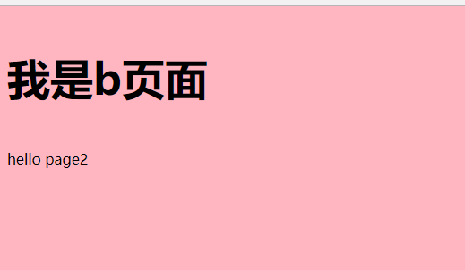

# 开始的开始
  步入前端已经一年多了，真心的体会到前端世界变化莫测，从jquery到vue，也算经历了一场大前端的变革。而在这几年，webapck的呼声越来越高。远超gulp，grunt等打包工具。平时使用vue-cli时用得biu顺，等到自己搭的时候就有点捉襟见肘了。
  # 项目的初始化
  使用`npm init`进行初始化操作 ，初始化界面会要求你输入对应的配置信息
```
package name: (demo-cli-blog)  //项目包名
version: (1.0.0)        //项目的版本
description: test       //项目的具体描述
entry point: (index.js) //项目的入口文件
test command:           //测试指令，默认为test
git repository:         //git的地址
keywords:               //关键词
author: talen           //作者信息
license: (ISC)          //证书号
```
填写完成后，文件目录里多出了一个json文件`package.json`：
```json
{
  "name": "demo-cli-blog",
  "version": "1.0.0",
  "description": "test",
  "main": "index.js",
  "scripts": {
    "test": "echo \"Error: no test specified\" && exit 1"
  },
  "author": "talen",
  "license": "ISC"
}
```
## 建立基本目录
在`demo-cli-blog`文件下建立如下目录：<br>


## 安装webpack
目录搭建完成后就开始安装webpack，（截止博客完成，webpack最新版本为4.6.0）。
<br>
首先，确认你是否安装过全局webpack，在命令提示板使用 `webpack -v`可以查看当前webpack的版本信息。
<br>

<br>
如果查询不到，就说明你可能没安装webpack全局环境，通过npm安装webpack
```
npm install webpack -g
```
同时webpack 4以上还需要安装webpack-cli（可以帮你拉取配置，过渡版本迁移）
```
npm install webpack-cli -g
```
  安装完webpack和webpack-cli后，就可以开始配置`webpack.config.js`文件了。
  ## 配置webpack文件
  * 首先配置入口文件和出口文件
  ```javascript
const config= {
    entry: {                        //入口文件（这是多页面配置）

        a:'./src/page1/a.js',   //index页面入口
        b:'./src/page2/b.js'   //page1页面入口


    },
    output: {                               //出口文件配置
        filename: './[name]/[name].js',     //出口文件存放位置，[name]代表块级文件流的名字，如入口文件中的a,b，最终会[name]的值就会变成a,b。目的是为了让每个页面在其单独的文件夹内
        path: path.resolve(__dirname, 'dist'), // 新建dist文件夹存放的位置，__dirname表示当前环境下的绝对路径
    },
  ```
  * 出口和入口文件配置完毕后，配置打包需要的插件和loader，在此之前应该使用npm管理工具在当前目录下安装这些插件和loader。比如：`webpack`,`webpack-cli`(当前目录也需要安装webpack，webpack-cli),`html-webpack-plugin`,`extract-text-webpack-plugin`,`'clean-webpack-plugin`,`style-loader`,`css-loader`,`url-loader`,`file-loader`,`html-loader`等等(插件安装所需包请自行百度，谷歌)……
  <br>
  ps：
  <br>
  1、注意在webpack4.6.0里面 `extract-text-webpack-plugin`由于版本支持的问题，所以需要
 ` npm install -s extract-text-webpack-plugin@next`安装与webpack4以上适应的版本，或者可以使用`mini-css-extract-plugin`。
 <br>
2、 webpack只会到打包js文件，所以css需要引入js才能打包
<br>


  ```javascript
const path = require('path');//引入node中的path模块
const webpack = require("webpack");//引入webpack
const HtmlWebpackPlugin = require("html-webpack-plugin");//引入html-webpack-plugin插件,作用是添加模板到编译完成后的dist的文件里面
const CleanWebpackPlugin = require("clean-webpack-plugin");//引入clean-webpack-plugin插件，作用是清除dist文件及下的内容，因为每次编译完成后都会有一个dist文件夹存放静态文件，所以需要清除上次的dist文件
const ExtractTextWebpackPlugin = require("extract-text-webpack-plugin");//引入extract-text-webpack-plugin插件，作用是把css文件单独存为一个文件，如果不用插件，css会以style标签的方式插入html中


const config= {
    entry: {                        //入口文件（这是多页面配置）

        a:'./src/page1/a.js',   //index页面入口
        b:'./src/page2/b.js'   //page1页面入口


    },
    output: {                               //出口文件配置
        filename: './[name]/[name].js',     //出口文件存放位置，[name]代表块级文件流的名字，如入口文件中的a,b，最终会[name]的值就会变成a,b。目的是为了让每个页面在其单独的文件夹内
        path: path.resolve(__dirname, 'dist'), // 新建dist文件夹存放的位置，__dirname表示当前环境下的绝对路径
    },


    plugins:[                                   //webpack插件部分

        //分割css插件
        new ExtractTextWebpackPlugin({

            filename:"[name]/[name].css",//制定编译后的目录
            allChunks:true,//把分割的块分别打包

        }),

        //配置html模板，因为是多页面，所以需配置多个模板
        new HtmlWebpackPlugin({

            title:'测试',//html标题
            filename:'./a/a.html',//文件目录名
            template:'./src/page1/a.html',//文件模板目录
            hash:true,//是否添加hash值
            chunks:['a'],//模板需要引用的js块，vendors是定义的公共块，index是引用的自己编写的块

        }),

        new HtmlWebpackPlugin({

            title:'页面一',
            filename:'./b/b.html',
            template:'./src/page2/b.html',
            hash:true,
            chunks:['b'],

        }),


        // 每次清空dist目录
        new CleanWebpackPlugin(['dist']),

    ],

    module:{

        rules:[

            {test:/\.css/,use:ExtractTextWebpackPlugin.extract({use:['css-loader']},)},//带css的css编译
            {test:/\.scss/,use:ExtractTextWebpackPlugin.extract({fallback:"style-loader",use:['css-loader','sass-loader']},)},//带scss的css编译
            {test:/\.(svg|jpg|jpeg|gif|woff|woff2|eot|ttf|otf)$/,use:[{loader:'file-loader',options: {outputPath: 'assets/'}}]},//图片和字体加载
            {test: /\.png$/, use: {loader:"url-loader",options:{mimetype:"image/png",limit:"4096"}}},//如果有png格式的图片，超过4M直接转化为base64格式
            {test: /\.html$/, use: {loader:'html-loader',  options: {           //打包html文件
                        minimize: true, //是否打包为最小值
                        removeComments: true,//是否移除注释
                        collapseWhitespace: true,//是否合并空格
                    }}},


        ],


    },


};


module.exports = config

  ```
  ## 打包后目录如下：
  
## 直接访问dist目录效果


