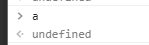
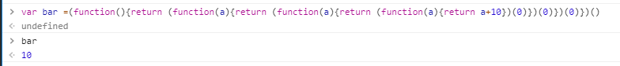

## 递归函数返回值为undefined
```javascript
function recursive(n){

if(n<4){


n++

recursive(n);


}else{

return n;

}

}

var a = recursive(0);
a //按我当初的想法，这里应该为4，也就是else后面的函数值输出
```

但是事实却总是那么揪心
<br>


## 究其原因

递归函数在调用递归时，是一层一层的嵌套，将上一段代码分解就是
```javascript

function recursive(n){

if(n<4){


n++

//recursive(n);(相当于)以下部分


//---------------------------嵌套函数部分
//按照我的理解，仅仅是个人理解（如有错误，请指正！）这里就是当n=1时的匿名执行函数
（function(n){
if(n<4){
n++
//······
}else{
return n;//这儿是返回值如果执行，就是返回给上一级函数，而上一级函数并没有接收这个值，
}
})(n);

//---------------------------嵌套函数部分


}else{

return n;

}

}

var a = recursive(0);

```
当在回调函数加上return时，函数相当于如下部分

```javascript

function recursive(n){

if(n<4){


n++

return（function(n){
if(n<4){
n++


//当走到最后一步时，n=4，这时函数应该走else

return （function(n){
if(n<4){
n++
//······省略前面重复部分
}else{
return n;//这时n应该为4，则return返回的n被上一层接收，如冒泡一样，直接被顶层接收并return出去
}
})(n);


}else{
return n;//这儿是返回值如果执行，就是返回给上一级函数，而上一级函数并没有接收这个值，
}
})(n);

//---------------------------嵌套函数部分


}else{

return n;

}

}

var a = recursive(0);

```
如果你还觉得晕，那就再让你晕点 

<br>


 好好理解一下吧。。。